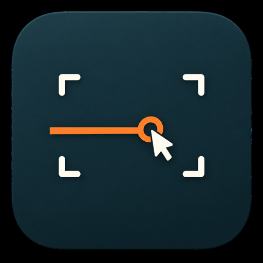
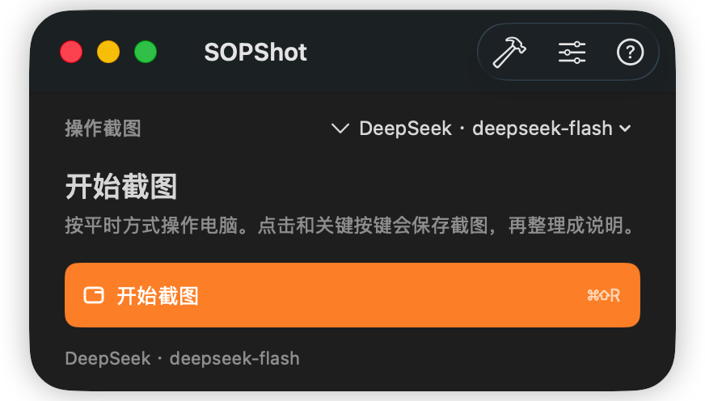
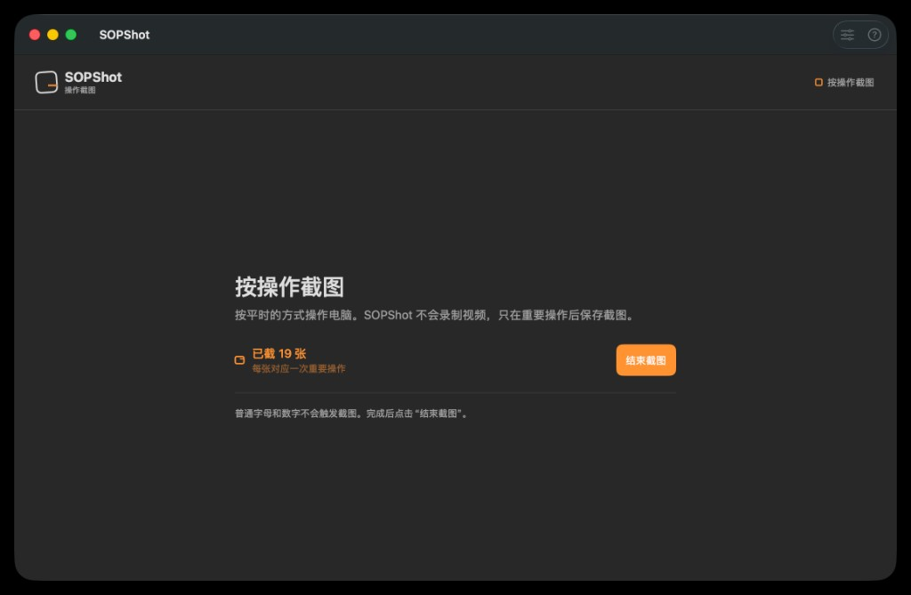

<p align="center">
  
</p>

<h1 align="center">SOPShot</h1>

<p align="center">
  <strong>把一次电脑操作，整理成一页可交接说明</strong><br>
  原生 macOS · 按操作截图 · 你自己的视觉模型 · 无自建服务器
</p>

<p align="center">
  
  
  
</p>

---

<p align="center">
  
</p>

SOPShot 不会替你托管模型，也不会录一整段视频。  
你按平时方式点几下、按几个关键键；它在本机留下对应截图。你确认后，再一次性发给自己的多模态接口，生成标题、适用对象和分步说明。

## 它解决什么

办公里常见的尴尬：口头教一遍，下周新人又来问；录屏又长又难剪；手工截图编号又烦。

SOPShot 的切口很窄：

> **屏幕上的操作过程 → 一页可复用的操作说明**

适合报销、内部系统、客户指引、支持话术这类「照着点就能做」的交接。

## 三步走完

```text
设置模型  →  按操作截图  →  检查并生成说明
```

| 步骤 | 你做什么 | SOPShot 做什么 |
| --- | --- | --- |
| 1 | 填入自己的 API Key，选一个视觉模型 | 只保存在本机 |
| 2 | 正常操作一遍电脑 | 点击 / 关键键后截一张图 |
| 3 | 删掉多余画面，可写补充说明 | 确认后才调用模型，导出 HTML / Markdown |

<p align="center">
  
</p>

<p align="center"><em>截图进行中：计数的是「张」，不是录屏时长</em></p>

<p align="center">
  
</p>

<p align="center"><em>检查截图：看画面、看操作数据、写补充说明，再点生成</em></p>

## 和「录屏工具」差在哪

| | 传统录屏 / 剪辑 | SOPShot |
| --- | --- | --- |
| 产物 | 视频或一堆散图 | 一页带图说明 |
| 触发 | 连续录像 | 重要操作才截图 |
| 模型 | 常要你自己剪、自己写 | 确认后一次性生成 |
| 服务器 | 很多要账号和云端 | **无中转，直连你的接口** |

普通字母和数字只记「有输入」，不记具体字符，也不触发截图。

## 支持的视觉模型

只保留「能看图、能回文字」的型号。预设包括：

- Google Gemini
- 阿里云百炼 · 通义千问
- 火山方舟 · 豆包
- OpenAI / Anthropic / DeepSeek / xAI / 智谱 GLM / Kimi / Mistral
- 自定义 OpenAI 兼容接口

型号清单按各厂商公开目录维护；以应用内「模型设置」为准。  
纯文本模型、生图/生视频模型不会出现在列表里。

## 隐私

- 截图从本机直接发到你填写的接口，SOPShot 不做中转
- API Key 保存在 `~/Library/Application Support/SOPShot/api-keys.json`（目录 `0700`，文件 `0600`）
- 不记录具体键入内容、剪贴板、密码
- 不写临时 MP4，不收音
- 导出前请自行检查画面里的姓名、手机号、账号等

首次使用需要：**屏幕录制** + **输入监控** 权限。

## 运行

```sh
./scripts/build-dev.sh
open SOPShot.app
```

需要：

- macOS 13+
- Swift 5.9+（Command Line Tools 或 Xcode）
- 本机开发签名证书 `SOPShot Development`（脚本会用固定身份签名，避免每次构建都丢权限）

也可用 Xcode / SwiftPM 直接构建 `Package.swift`。

快捷键：`⌘⇧R` 开始 / 结束截图（在检查页则是开始生成）。

## 当前边界

- 默认只采主显示器
- 本地不做 OCR，也不按画面相似度自动去重
- 草稿只在当前窗口，关掉就没了
- 还没有自动遮盖隐私字段
- 仍是可运行原型，不是完整商业产品

## 开源协议

[MIT](LICENSE)
