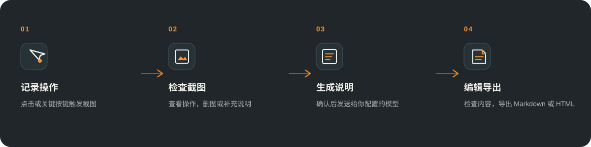
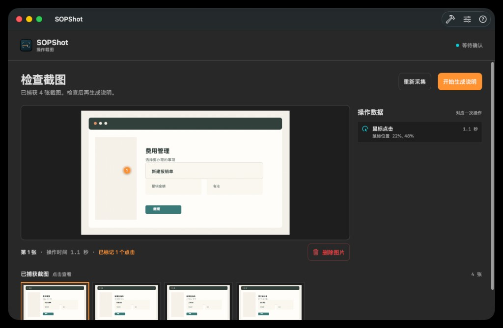

# SOPShot

按操作截图，检查后生成图文步骤。

[下载 macOS 版](https://github.com/wyf-yfw/SOPShot/releases) · [从源码运行](#从源码运行)

SOPShot 不录连续视频。鼠标点击和已启用的关键按键会触发截图。操作结束后，你可以逐张检查、删除不需要的画面，再把保留的截图和操作信息交给自己配置的视觉模型生成说明。

## 从操作到说明



### 检查截图，再生成

你可以查看每张截图对应的鼠标和键盘操作，删除多余画面，并补充流程背景。只有点击“开始生成说明”后，SOPShot 才会把内容发送到所选模型。



生成结果可以继续编辑，并导出为 Markdown 或 HTML。

## 截图如何触发

- 每次鼠标点击和已启用的关键按键，分别对应一张截图。
- 拖拽和滚动会在操作停下后截图。
- 普通字母和数字只记录为“键盘输入”事件，不保存具体字符，也不会触发截图。
- 可以在设置中调整哪些操作触发截图。

## 使用前准备

- macOS 13 或更新版本。
- 一个支持图像输入的模型，以及对应的 API Key。SOPShot 也支持自定义 OpenAI 兼容接口。
- 在系统设置中允许 SOPShot 使用“屏幕录制”和“输入监控”。

## 数据会发送到哪里

截图、操作事件信息和补充说明会在你点击生成后，直接发送到已配置的模型接口。SOPShot 不提供中转服务；数据如何处理取决于你选择的服务商。

API Key 保存在本机 `~/Library/Application Support/SOPShot/api-keys.json`，不使用苹果钥匙串。应用不会自动遮盖姓名、账号等画面内容，发送或导出前请先检查截图。本次采集不会自动保存为草稿，关闭并确认丢弃后无法恢复。

## 从源码运行

需要 macOS 13 或更新版本，以及 Swift 5.9+（Xcode 或 Command Line Tools）。

```sh
git clone https://github.com/wyf-yfw/SOPShot.git
cd SOPShot
./scripts/build-app.sh
open SOPShot.app
```

## 许可

[MIT](LICENSE)
